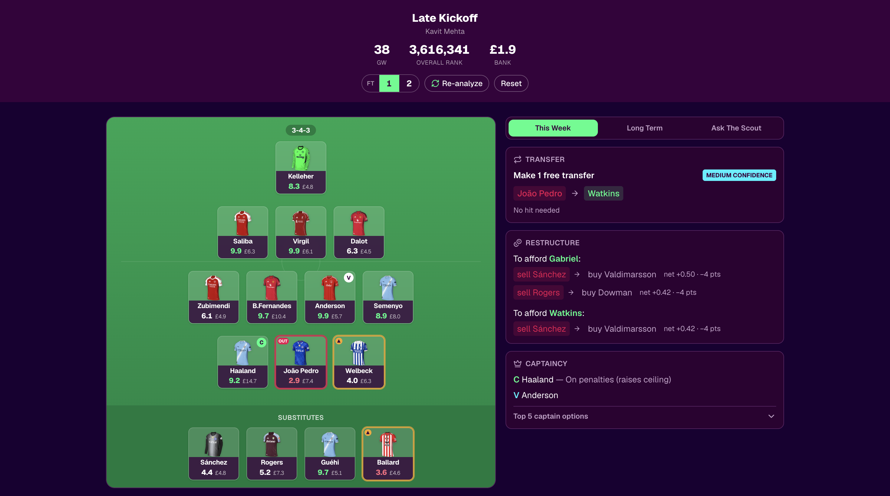
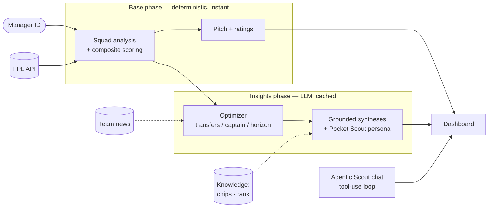
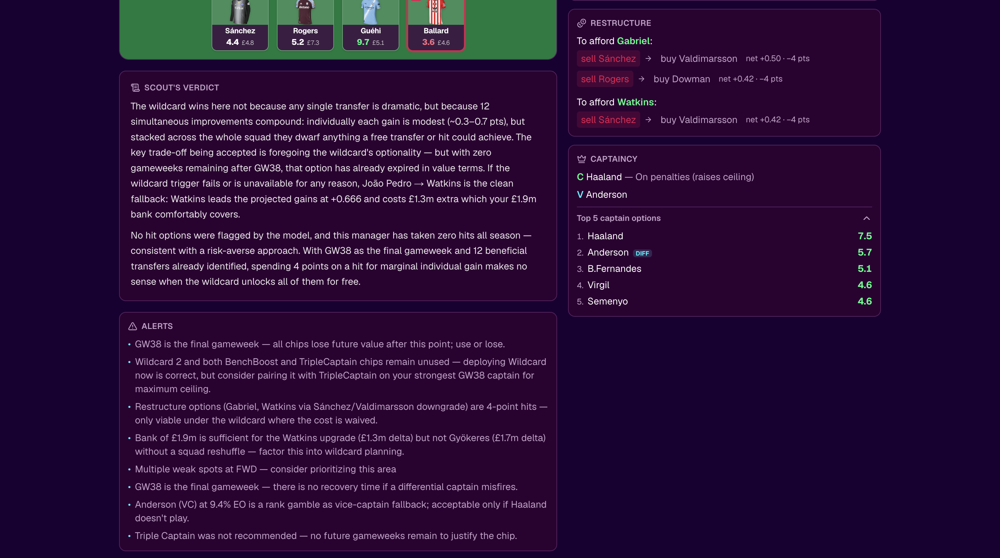
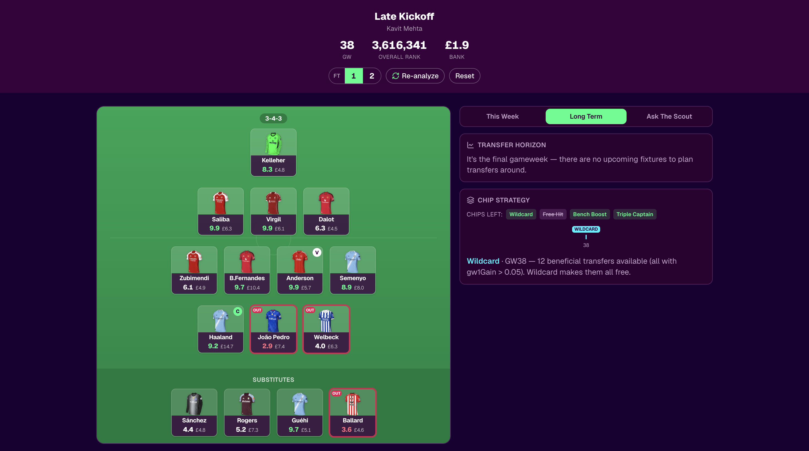
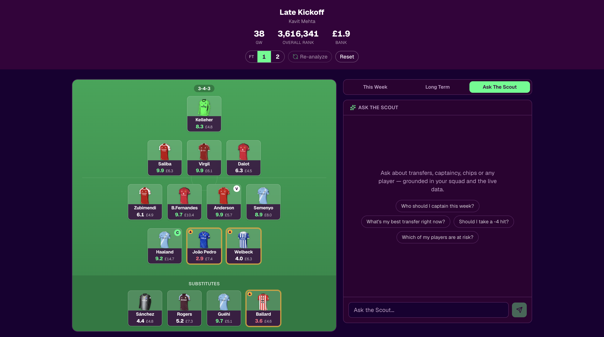
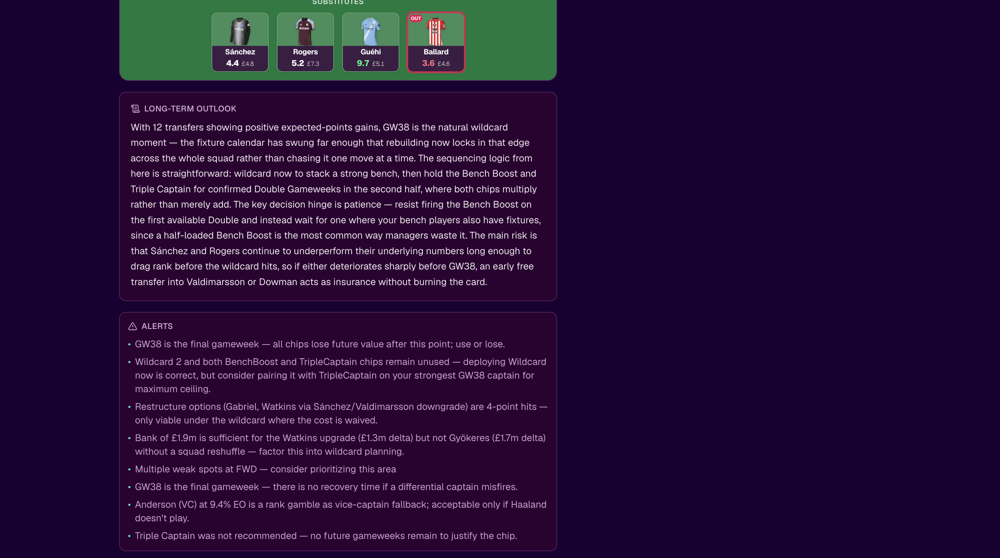

# Pocket Scout

**An agentic Fantasy Premier League advisor with a Premier League pundit's eye — grounded in real data, not vibes.**

Enter your FPL manager ID and Pocket Scout scouts your squad: transfer recommendations, captaincy, and chip strategy, each explained the way a post-match analyst breaks down a game. A deterministic scoring engine does the maths; a knowledge-grounded LLM layer does the reasoning; an agentic in-app chat answers "what if?".



## Demo

<!-- For an INLINE video player on GitHub: open this README in the github.com editor, drag
     docs/images/fpl-advisor-demo.mov into the text area — GitHub uploads it to its CDN and
     inserts a player URL — then replace the link below with that URL. (A repo-relative .mov
     renders as a download link, not a player.) -->
▶️ **[Watch the 90-second demo](docs/images/fpl-advisor-demo.mov)** — squad load → pitch paints → verdict streams in → Long Term → Ask The Scout.

---

## What it does

- **Pitch & ratings** — every squad player scored 0–10 by a position-aware composite model (anchored on FPL's expected points, corrected by form, fixtures, value, and underlying stats).
- **This Week** — a transfer recommendation gated on *projected points* (it holds rather than churning), plus EO-aware captaincy.
- **Long Term** — a multi-gameweek horizon and a chip-strategy timeline.
- **Ask The Scout** — an agentic chat that calls real tools (`simulate_transfer`, `score_player`, …) so it never invents numbers.

Everything is delivered in one consistent voice — **Pocket Scout** — and grounded in curated expert knowledge (chip timing, effective-ownership strategy).

## Architecture at a glance



The pitch paints **immediately** from a fast deterministic phase; the LLM insights stream in after. → **Full breakdown: [docs/ARCHITECTURE.md](docs/ARCHITECTURE.md)**

## What makes it interesting (engineering)

It's built **eval-first**: a point-in-time backtest harness over 10 seasons of FPL data drives the model, and decisions are made on evidence — including the honest negative ones.

- The player-ranking model was **fit from data, not hand-tuned** — lifting within-position rank correlation from ~0.33 to ~0.53 (approaching FPL's own ~0.59).
- A replay on real squads showed the transfer optimizer **over-recommended moves**; that finding drove a points-based "hold" gate that fixed it.
- A proposed fixture-difficulty upgrade was **measured and rejected** — the data said it was worse.

→ **The full story (backtests, replays, the no-ship): [docs/EVALUATION.md](docs/EVALUATION.md)**

## Screenshots

| This Week — verdict + transfer | Long Term — chip timeline & horizon |
|---|---|
|  |  |

| Ask The Scout — agentic chat | Long Term — Scout's outlook |
|---|---|
|  |  |

## Quickstart

You need an [Anthropic API key](https://console.anthropic.com/) for the AI features. **It also runs without one** — the pitch, ratings, and deterministic recommendations work; only the LLM prose falls back.

**Option A — dev (simplest):**
```bash
git clone https://github.com/LionelKavit/Fantasy-Premier-League-Advisor.git
cd Fantasy-Premier-League-Advisor
npm install
echo "ANTHROPIC_API_KEY=sk-ant-..." > .env.local   # optional
npm run dev
# open http://localhost:3000  (enter any public FPL manager ID)
```

**Option B — production build (Docker + Caddy):**
```bash
# create .env.docker (gitignored) with at least your key:
#   ANTHROPIC_API_KEY=sk-ant-...
#   SITE_ADDRESS=:80
#   BASIC_AUTH_USER=admin
#   BASIC_AUTH_HASH=...   # see note below
docker compose up --build
# open http://localhost  (log in if you set basic-auth)
```
> **Note on the password hash:** generate it with `docker run --rm caddy:2-alpine caddy hash-password --plaintext 'yourpass'`, then **double every `$` to `$$`** in `.env.docker` (Docker Compose otherwise reads `$` as a variable). Details in [docs/ARCHITECTURE.md](docs/ARCHITECTURE.md).

## Tech stack

Next.js 16 (App Router) · React 19 · TypeScript · Tailwind + shadcn · Anthropic Claude (Sonnet) · Vitest (204 tests) · Docker + Caddy · the public FPL API.

## Project notes

- **Spec-driven:** built with [OpenSpec](https://github.com/Fission-AI/OpenSpec) — ~28 documented change proposals live under `openspec/changes/archive/` (the paper trail behind every feature and eval decision).
- **Status:** feature-complete demo; a couple of changes are intentionally parked for the 2026-27 season (forward evaluation + cold-start hardening).

## Documentation

| Doc | What's in it |
|---|---|
| [docs/ARCHITECTURE.md](docs/ARCHITECTURE.md) | The decision pipeline, the agentic chat, knowledge grounding, deployment |
| [docs/EVALUATION.md](docs/EVALUATION.md) | The backtest harness, the data-fit model, squad replays, and the honest no-ship |
