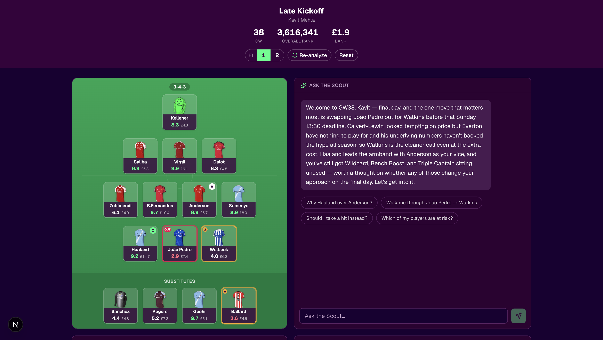
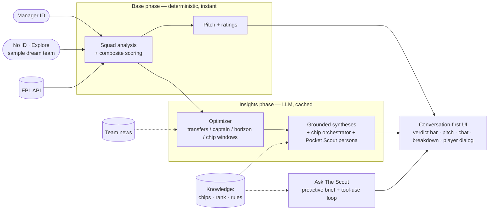
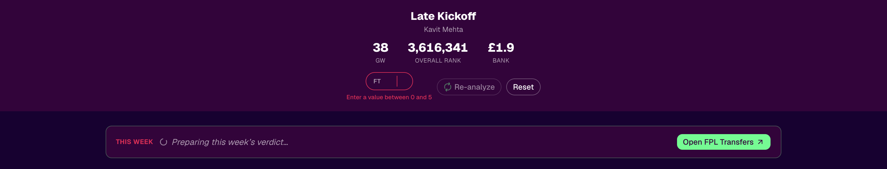
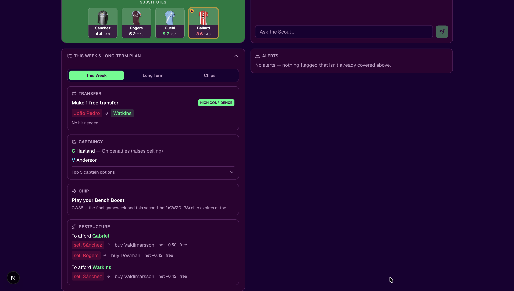
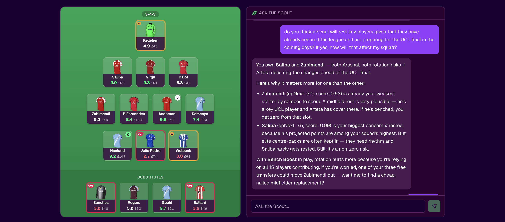
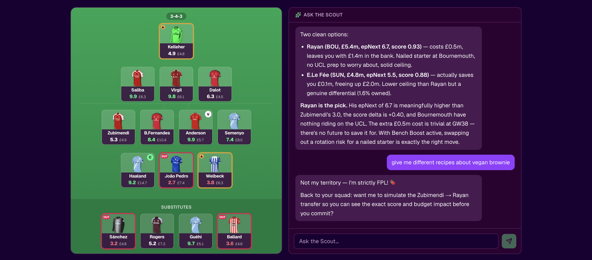
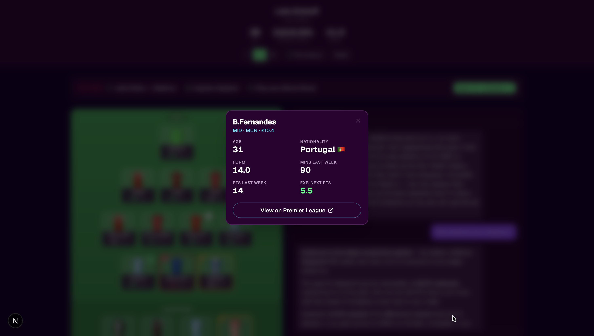
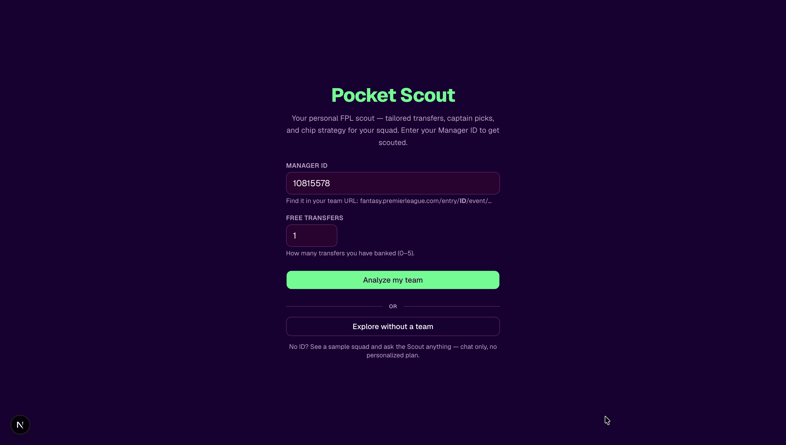
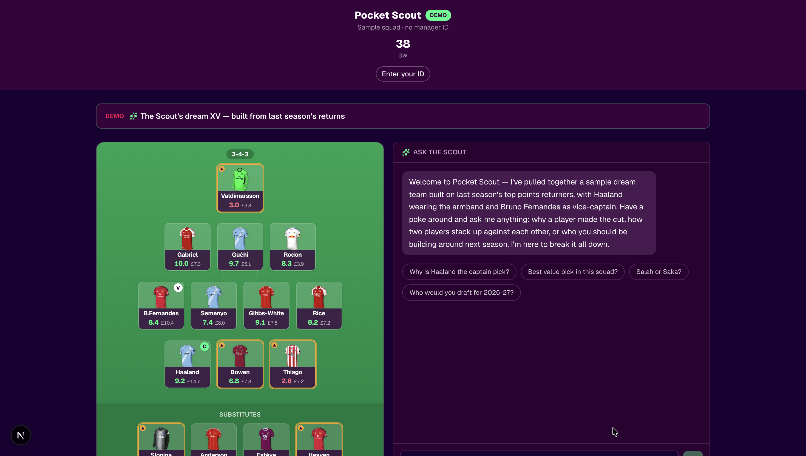

# Pocket Scout

**An agentic Fantasy Premier League advisor with a Premier League pundit's eye — grounded in real data, not vibes.**

Every gameweek, millions of FPL managers face the same dread: a transfer to make (or two, or five), a captain to pick, a chip you're terrified to waste — and a deadline counting down. So you crowd-source it: group chats, Reddit, ten browser tabs of conflicting "templates," none of which know *your* squad, *your* bank, or how many free transfers you're actually holding. You make the call on a hunch and find out on Saturday.

**Pocket Scout is your personal scout.** Enter your FPL manager ID and it reads *your* team and tells you the highest-leverage move this week — transfers, captaincy, chips — and **explains why**, the way a post-match analyst breaks down a game. It's **personalized** (your squad, your bank, the exact free transfers you hold), **educated** (grounded in expert FPL principles and the live rules), and **deterministic** (a reproducible engine does the maths — same squad, same answer — not an LLM guessing).



### Why it beats a group chat

- **It knows your constraints.** Tell it how many free transfers you have — anywhere from **0 to 5** — and it plans *within that budget*: up to that many **stacked transfers**, or a sell-to-fund-a-dream **restructure** when that out-projects straight swaps. It even **banks** a transfer rather than burn it on a marginal move.
- **It holds when holding is right.** Every move is judged in **expected points**; if nothing clears the bar, it tells you to roll — the opposite of the churn most tools nudge you toward.
- **It shows its work.** A deterministic 0–10 model does the maths; the **Ask The Scout** chat fetches *real* numbers via tool calls, so it never invents a stat or contradicts the panels.

## Watch the Pocket Scout in action

<!-- For an INLINE video player on GitHub: open this README in the github.com editor, drag
     docs/images/fpl-advisor-demo.mov into the text area — GitHub uploads it to its CDN and
     inserts a player URL — then replace the link below with that URL. (A repo-relative .mov
     renders as a download link, not a player.) -->


https://github.com/user-attachments/assets/93f5c5eb-443b-4edb-b4d6-2a8c6037cfe0


---

## What it does

- **Glanceable verdict** — one always-visible line above the fold spans the pitch and chat: *"This week: Sánchez → Raya +1 more transfer · Captain Haaland · Play your Bench Boost"*, with an **Open FPL Transfers** deep link at the end. Derived deterministically and shown only once the decision is final (no mid-flight captain swap).
- **Pitch & ratings** — every squad player scored 0–10 by a position-aware composite model (anchored on FPL's expected points, corrected by form, fixtures, value, and underlying stats).
- **Ask The Scout (the hero)** — the conversation is the primary surface: the Scout opens with a proactive, deadline-aware brief, then answers "what if?" via real tool calls (`simulate_transfer`, `score_player`, …), grounded in your committed plan **and the curated knowledge base**, so it never invents numbers or contradicts the panels.
- **Act on it** — close the last mile: click any pitch player or transfer name for a **detail dialog** (age, nationality, form, last-week minutes/points, expected next points) with a **View on Premier League** link; the verdict bar hands you off to the FPL transfers screen.
- **Breakdown** — a collapsible drawer with three tabs:
  - *This Week* — clear sections in order: **Transfer · Captaincy · Chip · Restructure** — up to **N free transfers** ("Make 3 free transfers"), chosen by an expected-points allocation that weighs straight swaps against a **restructure** (sell-to-fund-a-dream) and **holds rather than churns**; EO-aware captaincy; and the chip call in its own section (so a Bench Boost never hides your free transfers). The Restructure section lists alternative dream-funding chains, each priced against the free transfers you have left.
  - *Long Term* — a multi-gameweek horizon.
  - *Chips* — an LLM-orchestrated chip plan (play now / hold / sequenced windows), grounded in chip principles and the deterministic candidate windows.
- **Explore without a team** — no FPL ID required: Pocket Scout builds a **season-aware sample "dream team"** (best XV by FPL's projected points in-season, last-season returns off-season) and you can **Ask The Scout** anything. The chat is the whole point in this mode — there's no personalized transfer plan, and the chat is grounded in the current FPL rules so it never answers from stale knowledge.

Everything is delivered in one consistent voice — **Pocket Scout** — and grounded in curated expert knowledge (chip timing, effective-ownership strategy, and the FPL rules).

## Architecture at a glance



> In **demo mode** (no ID) the base phase paints a synthesized sample squad, the insights phase runs **captaincy only** (the optimizer is skipped — no transfers/horizon/chips), and the chat answers general FPL questions grounded in the rules.

The pitch paints **immediately** from a fast deterministic phase; the Scout then opens with a proactive brief and the LLM insights stream in. → **Full breakdown: [docs/ARCHITECTURE.md](docs/ARCHITECTURE.md)**

## What makes it interesting (engineering)

It's built **eval-first**: a point-in-time backtest harness over 10 seasons of FPL data drives the model, and decisions are made on evidence — including the honest negative ones.

- The player-ranking model was **fit from data, not hand-tuned** — lifting within-position rank correlation from ~0.33 to ~0.53 (approaching FPL's own ~0.59).
- A replay on real squads showed the transfer optimizer **over-recommended moves**; that finding drove a points-based "hold" gate that fixed it.
- A proposed fixture-difficulty upgrade was **measured and rejected** — the data said it was worse.

→ **The full story (backtests, replays, the no-ship): [docs/EVALUATION.md](docs/EVALUATION.md)**

## Screenshots

| Tell it your situation — enter **0–5 free transfers** | This Week — **Make N free transfers** + the ep-native Restructure |
|---|---|
|  |  |

**Expert, grounded chat — no hallucinations, no prompt injection.** Ask The Scout reasons over *real* numbers it fetches via tool calls, stays anchored to your committed plan and the curated knowledge base, and refuses to be talked out of the facts — so its answers never drift from the panels or invent stats.

| Ask The Scout — a tool-grounded answer citing real numbers | …and it holds the line against off-topic / injection attempts |
|---|---|
|  |  |

| Player detail dialog — click any player to inspect | Get scouted — enter your manager ID, or explore without one |
|---|---|
|  |  |

| Explore without a team — the demo dream team + Scout chat |
|---|
|  |

## Quickstart

You need an [Anthropic API key](https://console.anthropic.com/) for the AI features. **It also runs without one** — the pitch, ratings, and deterministic recommendations work; only the LLM prose falls back.

**Option A — dev (simplest):**
```bash
git clone https://github.com/LionelKavit/Fantasy-Premier-League-Advisor.git
cd Fantasy-Premier-League-Advisor
npm install
echo "ANTHROPIC_API_KEY=sk-ant-..." > .env.local   # optional
npm run dev
# open http://localhost:3000  (enter any public FPL manager ID — or click "Explore without a team")
```

**Option B — production build (Docker + Caddy):**
```bash
# create .env.docker (gitignored) with at least your key:
#   ANTHROPIC_API_KEY=sk-ant-...
#   SITE_ADDRESS=:80
#   BASIC_AUTH_USER=admin
#   BASIC_AUTH_HASH=...   # see note below
docker compose up --build
# open http://localhost  (log in if you set basic-auth)
```
> **Note on the password hash:** generate it with `docker run --rm caddy:2-alpine caddy hash-password --plaintext 'yourpass'`, then **double every `$` to `$$`** in `.env.docker` (Docker Compose otherwise reads `$` as a variable). Details in [docs/ARCHITECTURE.md](docs/ARCHITECTURE.md).

## Tech stack

Next.js 16 (App Router) · React 19 · TypeScript · Tailwind + shadcn · Anthropic Claude (Sonnet, with prompt caching) · Vitest (331 tests) · Docker + Caddy · the public FPL API.

## Project notes

- **Spec-driven:** built with [OpenSpec](https://github.com/Fission-AI/OpenSpec) — ~50 documented change proposals live under `openspec/changes/archive/` (the paper trail behind every feature and eval decision).
- **Status:** feature-complete demo; a couple of changes are intentionally parked for the 2026-27 season (forward evaluation + cold-start hardening).

## Documentation

| Doc | What's in it |
|---|---|
| [docs/ARCHITECTURE.md](docs/ARCHITECTURE.md) | The decision pipeline, the agentic chat, knowledge grounding, deployment |
| [docs/EVALUATION.md](docs/EVALUATION.md) | The backtest harness, the data-fit model, squad replays, and the honest no-ship |
