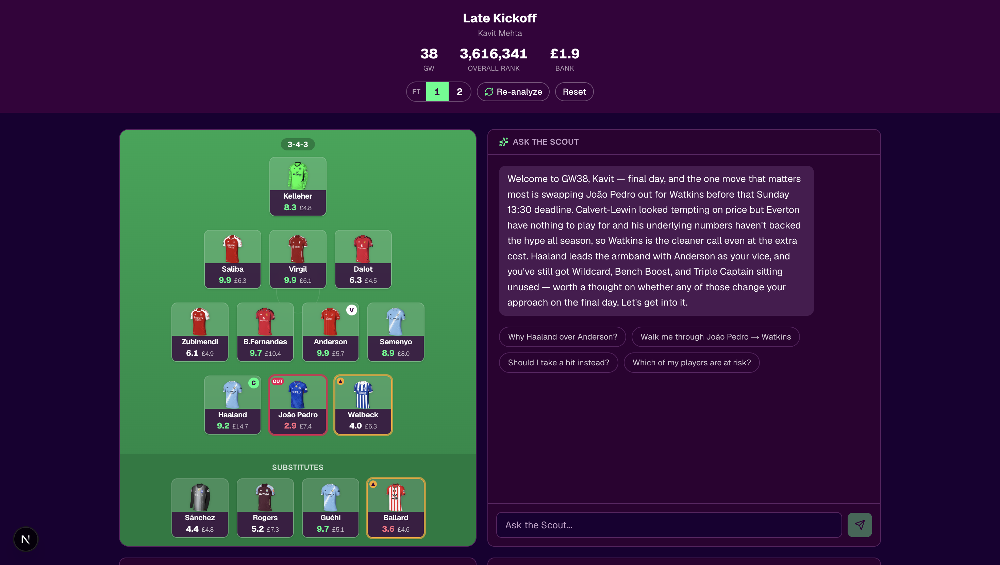
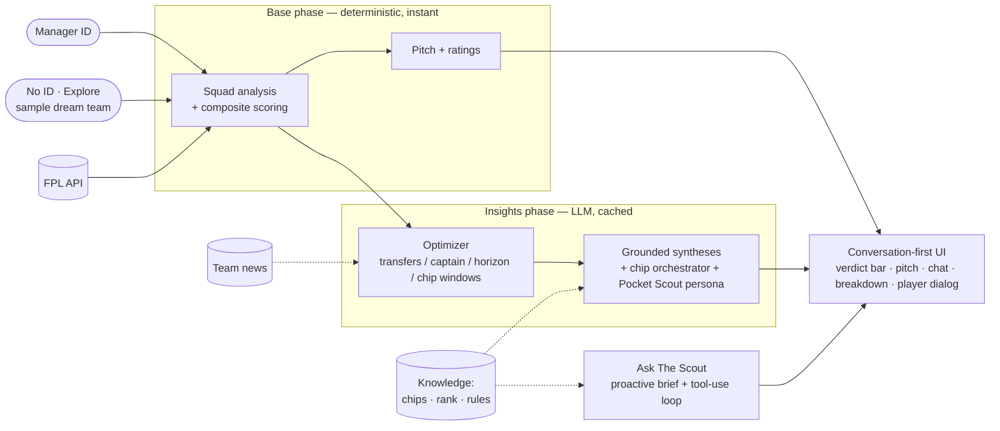
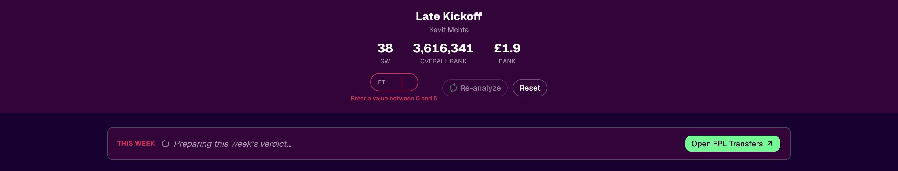
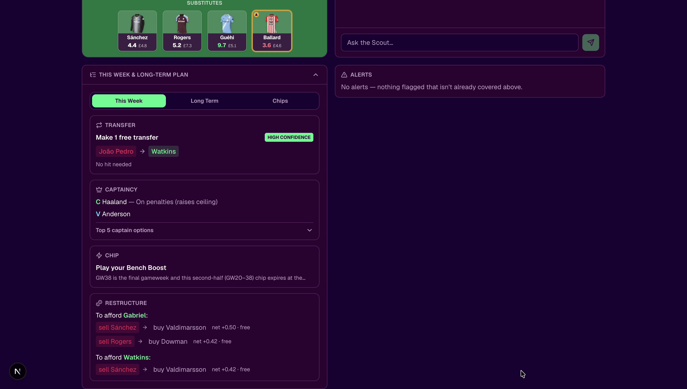
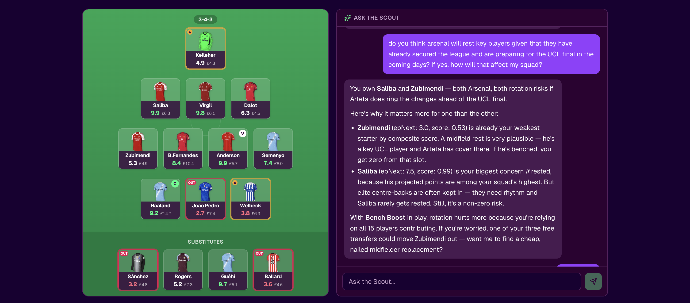
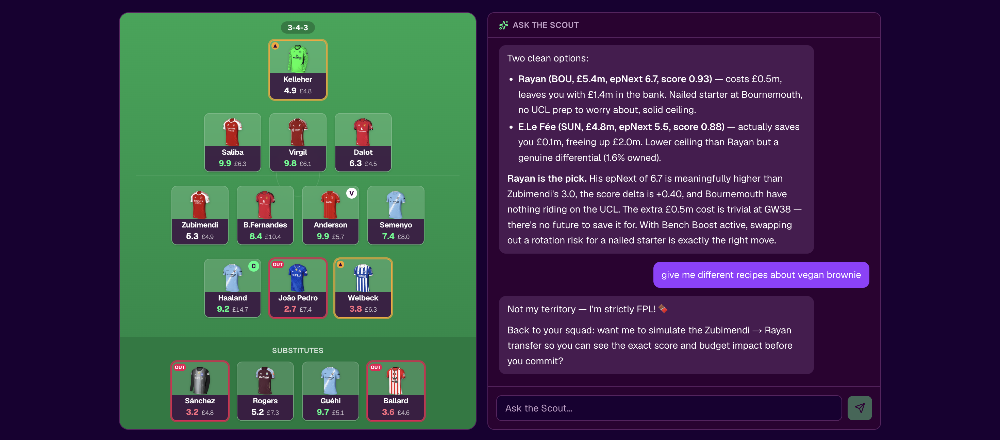
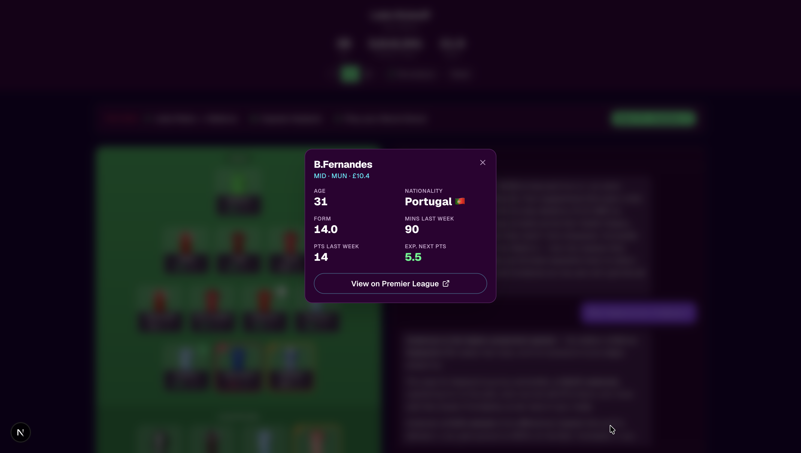
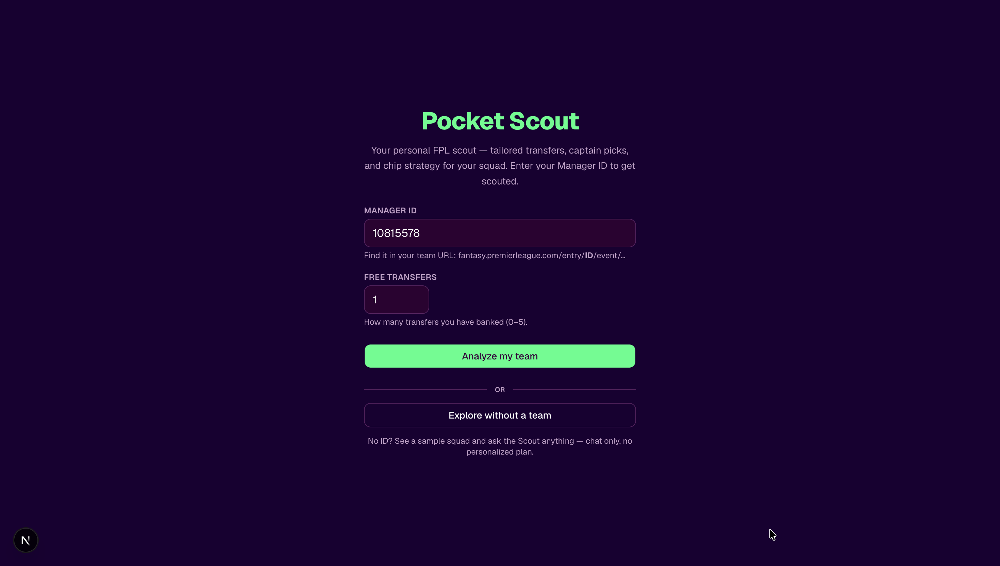
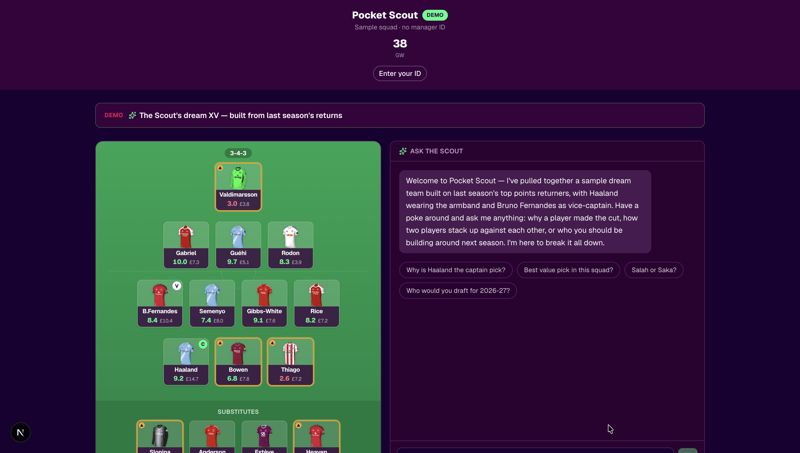

# Pocket Scout

**An agentic Fantasy Premier League advisor with a Premier League pundit's eye — grounded in real data, not vibes.**

Every gameweek, millions of FPL managers face the same dread: a transfer to make (or two, or five), a captain to pick, a chip you're terrified to waste — and a deadline counting down. So you crowd-source it: group chats, Reddit, ten browser tabs of conflicting "templates," none of which know *your* squad, *your* bank, or how many free transfers you're actually holding. You make the call on a hunch and find out on Saturday.

**Pocket Scout is your personal scout.** Enter your FPL manager ID and it reads *your* team and tells you the highest-leverage move this week — transfers, captaincy, chips — and **explains why**, the way a post-match analyst breaks down a game. It's **personalized** (your squad, your bank, the exact free transfers you hold), **educated** (grounded in expert FPL principles and the live rules), and **deterministic** (a reproducible engine does the math — same squad, same answer — not an LLM guessing).



### Why it beats a group chat

- **It knows your constraints.** Tell it how many free transfers you have — anywhere from **0 to 5** — and it plans *within that budget*: up to that many **stacked transfers**, or a sell-to-fund-a-dream **restructure** when that out-projects straight swaps. It even **banks** a transfer rather than burn it on a marginal move.
- **It holds when holding is right.** Every move is judged in **expected points**; if nothing clears the bar, it tells you to roll — the opposite of the churn most tools nudge you toward.
- **It shows its work.** A deterministic 0–10 model does the math; the **Ask The Scout** chat fetches *real* numbers via tool calls, so it never invents a stat or contradicts the panels.

## Watch the Pocket Scout in action

<!-- For an INLINE video player on GitHub: open this README in the github.com editor, drag
     docs/images/fpl-advisor-demo.mov into the text area — GitHub uploads it to its CDN and
     inserts a player URL — then replace the link below with that URL. (A repo-relative .mov
     renders as a download link, not a player.) -->


https://github.com/user-attachments/assets/93f5c5eb-443b-4edb-b4d6-2a8c6037cfe0


---

## What it does

- **One clear answer at the top.** The first thing you see is this week's advice in a single line: who to sell and who to buy, who to captain, and whether to play a chip. A button beside it takes you straight to the FPL transfers page.

- **A rating for every player in your squad.** Each player on the pitch gets a score out of 10. It starts from FPL's own points prediction for the next match and adjusts it for recent form, upcoming fixtures, price, and how well the player is really performing underneath the headline numbers.

- **Ask The Scout.** This is the heart of the app. The Scout greets you with a short brief for the coming deadline, then you can ask it anything in plain words: *"Should I swap Wissa for Emersonn?"*, *"Who should I captain?"*, *"Is it worth taking a hit?"* It looks up the real numbers before it answers, so it never makes things up, and what it says always matches the advice on screen.

- **Act on it.** Click any player, on the pitch or in a suggestion, for a quick card: age, nationality, recent form, last week's minutes and points, and expected points next week, with a link to their Premier League profile. When you are ready, the banner at the top hands you over to FPL to make the move.

- **The full breakdown**, in a drawer you open when you want the detail, in three tabs:
  - **This Week** — the transfers to make, using as many free transfers as you have (and telling you to hold if no move is worth it), the captain and vice-captain, whether to play a chip, and bigger "sell one player to afford a better one" ideas.
  - **Long Term** — which transfers are worth making now, which are better left for a few weeks, and which only pay off for a short spell, judged on each player's upcoming fixtures.
  - **Chips** — a plan for the chips you still hold: play one now, keep it, or aim for a particular week later in the season.

- **Try it without a team.** No FPL ID? Pocket Scout builds a sample squad from the best players in the game, and you can still ask the Scout anything about FPL. In this mode there is no personal transfer plan, just the chat, and it always answers from this season's rules.

Everything comes in one voice, **Pocket Scout**, backed by expert FPL knowledge: when to play chips, how player ownership affects your rank, and the official rules.

## Architecture at a glance


```mermaid
flowchart LR
  U([Manager ID]) --> BASE
  D([No ID · Explore<br/>sample dream team]) --> BASE
  subgraph Fast["Base phase — deterministic, instant"]
    BASE[Squad analysis<br/>+ composite scoring] --> PITCH[Pitch + ratings]
  end
  subgraph Slow["Insights phase — LLM, cached"]
    OPT[Optimizer<br/>transfers / captain / horizon / chip windows] --> SYN[Grounded syntheses<br/>+ chip orchestrator + Pocket Scout persona]
  end
  BASE --> OPT
  FPL[(FPL API)] --> BASE
  NEWS[(Team news)] -.-> OPT
  KB[(Knowledge:<br/>chips · rank · rules)] -.-> SYN
  KB -.-> CHAT
  PITCH --> UI[Conversation-first UI<br/>verdict bar · pitch · chat · breakdown · player dialog]
  SYN --> UI
  CHAT[Ask The Scout<br/>proactive brief + tool-use loop] --> UI
```

> In **demo mode** (no ID) the base phase paints a synthesized sample squad, the insights phase runs **captaincy only** (the optimizer is skipped — no transfers/horizon/chips), and the chat answers general FPL questions grounded in the rules.

The pitch paints **immediately** from a fast deterministic phase; the Scout then opens with a proactive brief and the LLM insights stream in. → **Full breakdown: [docs/ARCHITECTURE.md](docs/ARCHITECTURE.md)**

## What makes it interesting (engineering)

Before the app gives advice, that advice is tested against ten seasons of real FPL history to see whether it would actually have earned points. Decisions about the app are made on that evidence, including when the evidence says no.

- The player rating was **tuned on data, not by hand**. On past seasons it ranks players much better than the original version, and comes close to FPL's own prediction.
- Replaying past seasons showed the app was **recommending too many transfers**. That led to a simple rule: a transfer is only suggested when it is projected to earn clearly more points than keeping the player you have.
- An idea for rating fixtures differently was **tested and dropped**, because the numbers showed it made the advice worse.

→ **The full story (backtests, replays, the no-ship): [docs/EVALUATION.md](docs/EVALUATION.md)**

## Screenshots

| Tell it your situation — enter **0–5 free transfers** | This Week — **Make N free transfers** + the ep-native Restructure |
|---|---|
|  |  |

**Expert, grounded chat — no hallucinations, no prompt injection.** Ask The Scout reasons over *real* numbers it fetches via tool calls, stays anchored to your committed plan and the curated knowledge base, and refuses to be talked out of the facts — so its answers never drift from the panels or invent stats.

| Ask The Scout — a tool-grounded answer citing real numbers | …and it holds the line against off-topic / injection attempts |
|---|---|
|  |  |

| Player detail dialog — click any player to inspect | Get scouted — enter your manager ID, or explore without one |
|---|---|
|  |  |

| Explore without a team — the demo dream team + Scout chat |
|---|
|  |

## Quickstart

You need an [Anthropic API key](https://console.anthropic.com/) for the AI features. **It also runs without one** — the pitch, ratings, and deterministic recommendations work; only the LLM prose falls back.

**Option A — dev (simplest):**
```bash
git clone https://github.com/LionelKavit/Fantasy-Premier-League-Advisor.git
cd Fantasy-Premier-League-Advisor
npm install
echo "ANTHROPIC_API_KEY=sk-ant-..." > .env.local   # optional
npm run dev
# open http://localhost:3000  (enter any public FPL manager ID — or click "Explore without a team")
```

**Option B — production build (Docker + Caddy):**
```bash
# create .env.docker (gitignored) with at least your key:
#   ANTHROPIC_API_KEY=sk-ant-...
#   SITE_ADDRESS=:80
#   BASIC_AUTH_USER=admin
#   BASIC_AUTH_HASH=...   # see note below
docker compose up --build
# open http://localhost  (log in if you set basic-auth)
```
> **Note on the password hash:** generate it with `docker run --rm caddy:2-alpine caddy hash-password --plaintext 'yourpass'`, then **double every `$` to `$$`** in `.env.docker` (Docker Compose otherwise reads `$` as a variable). Details in [docs/ARCHITECTURE.md](docs/ARCHITECTURE.md).

## Tech stack

Next.js 16 (App Router) · React 19 · TypeScript · Tailwind + shadcn · Anthropic Claude (Sonnet, with prompt caching) · Vitest (331 tests) · Docker + Caddy · the public FPL API.

## Project notes

- **Spec-driven:** built with [OpenSpec](https://github.com/Fission-AI/OpenSpec) — ~50 documented change proposals live under `openspec/changes/archive/` (the paper trail behind every feature and eval decision).
- **Status:** feature-complete demo; a couple of changes are intentionally parked for the 2026-27 season (forward evaluation + cold-start hardening).

## Documentation

| Doc | What's in it |
|---|---|
| [docs/ARCHITECTURE.md](docs/ARCHITECTURE.md) | The decision pipeline, the agentic chat, knowledge grounding, deployment |
| [docs/EVALUATION.md](docs/EVALUATION.md) | The backtest harness, the data-fit model, squad replays, and the honest no-ship |
