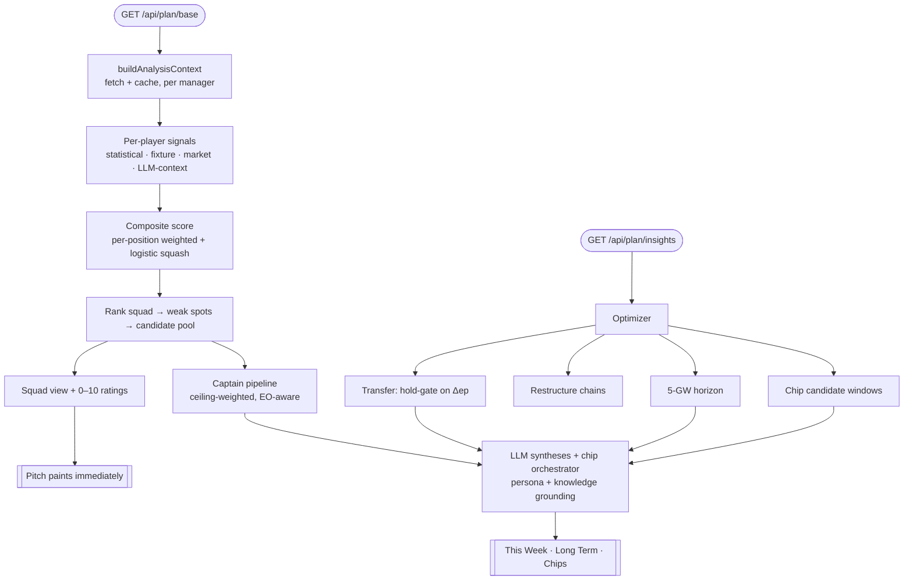
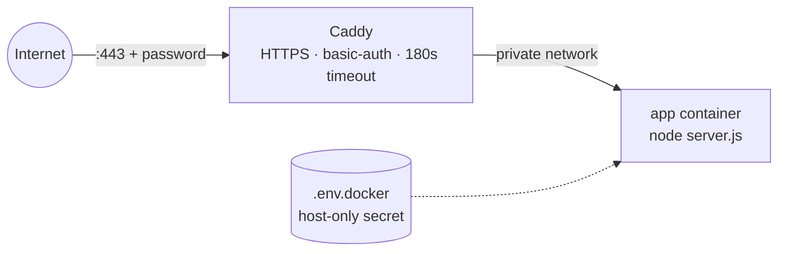

# Architecture

Pocket Scout is a single **long-running Next.js server**: a deterministic FPL scoring engine, an LLM reasoning layer on top, and an agentic chat as the primary, **conversation-first** surface. No database — all state is per-request or in short-lived in-memory caches.

## Request flow (two phases)

A page load runs in two phases so the UI is never blocked on the LLM:



- **Base phase** (`/api/plan/base`) — deterministic only. Builds the squad analysis and composite scores; returns the pitch. Fast, no LLM. The client renders the **glanceable verdict bar** above the fold from the merged plan once insights land (so the captain/transfer are final, never swapped mid-flight), with an **Open FPL Transfers** deep link that hands off to the FPL transfers screen.
- **Insights phase** (`/api/plan/insights`) — runs the optimizer + captain logic, then the LLM syntheses. Cached per `manager:gw:freeTransfers:horizon`.
- **Player detail** (`/api/player/[id]`) — a lightweight, on-demand route behind the **player dialog** (opened from a pitch token or a This-Week transfer name). It reuses the warm bootstrap + element-summary caches the insights phase already populated, so for an analyzed player it issues **no new FPL request**; returns name, age, nationality, form, last-week minutes/points, and expected next points, plus the `opta_code` that builds the **View on Premier League** link.

## The deterministic engine

**Signals** (`lib/pipeline/`) — per player, normalised to 0–1:
- *statistical* — form, goal/assist threat (xG/xA-based), bonus, value, clean-sheet/xGC (defenders), saves (keepers).
- *fixture* — opponent difficulty (FPL's FDR) + a position-aware opponent-strength signal.
- *market* — `epNextSignal` (FPL's expected points, normalised by the pool max), ownership, transfer momentum.
- *LLM-context* — rotation/injury/tactical signals (see [Knowledge & grounding](#knowledge--grounding)).

**Composite score** (`lib/pipeline/composite-scorer.ts`) — a per-position linear model:
```
total = squash( Σ wᵢ · signalᵢ  +  trendAdj + llmAdj − suspensionPenalty )
```
- Weights are **data-fit** (ridge regression on a backtest), epNext-dominant, with signed corrections (e.g. price is a negative per-point term).
- A strictly-monotonic **logistic squash** maps the raw score into (0,1) for the "/10" display without tie-collapsing at the bounds.
- Details + how the weights were derived: **[EVALUATION.md](EVALUATION.md)**.

**Optimizer** (`lib/optimizer/`) — ranks candidate transfers, but the *go/hold* decision is gated on **projected points**: recommend a transfer only if `Δep = in.epNext − out.epNext` clears a bar (≈1.5 free, >4 for a hit); otherwise hold. Also computes restructure chains, a 5-GW horizon, and chip **candidate windows** (DGW/BGW-aware, plus a use-it-or-lose-it last-call on the half deadline). Those windows are deterministic candidates; an LLM **chip orchestrator** (`chip-orchestrator.ts`), grounded in `chips.md`, turns them into the committed chip plan — play-now / hold / sequenced — that both This Week and the Chips tab read (a single source of truth).

**Captain** (`lib/captain/`) — a separate ceiling-weighted model (explosiveness, set-pieces, fixture, minutes certainty), with template-vs-differential awareness driven by the manager's rank.

## The LLM layer

**Syntheses** (`lib/optimizer/synthesis.ts`, `lib/captain/synthesis.ts`, the chip orchestrator `lib/optimizer/chip-orchestrator.ts`, and the opening brief `lib/scout/brief.ts`) turn the deterministic results into prose — the transfer verdict, the captaincy call, the chip plan, and the proactive opening brief. They are:
- **Persona-unified** — all share `lib/llm/persona.ts` (the *Pocket Scout* identity) as their system instruction.
- **Knowledge-grounded** — curated markdown (`lib/knowledge/chips.md`, `rank-strategy.md`) is injected so chip timing and effective-ownership reasoning reflect expert principles, not generic model priors.
- **Format-safe** — several return structured JSON that the UI renders; the persona explicitly defers to each task's output format.
- **Prompt-cached** — `cache_control` marks the stable system / agent prefixes so repeated prefixes (notably the agentic chat's multi-round loop) bill at the cache-read rate.

**Agentic Scout chat** (`lib/scout/`) — Ask The Scout is the **hero conversation**: it opens proactively with a deadline-aware brief, then runs a stateless tool-use loop where the model calls tools (`get_plan`, `score_player`, `simulate_transfer`, `simulate_captain`) to fetch *real* numbers rather than hallucinate them, streaming the reply token-by-token. It's grounded in the committed chip plan, your held chips, **and the curated knowledge base** (`chips.md` + `rank-strategy.md`, injected via `loadKnowledge`) — with the committed chip plan held **authoritative over** those principles for the chip decision, so the chat reasons with expert principles but never issues a competing chip verdict to the panels.

### Knowledge & grounding

| Layer | Source | Type | Feeds |
|---|---|---|---|
| Rotation / injury | predicted-lineup news (fetched, LLM-extracted → structured) | dynamic data | `LlmContextSignals` → composite + captain |
| Chip timing | `lib/knowledge/chips.md` | static principles | the **chip orchestrator** → chip plan · the **Scout chat** |
| Rank / EO | `lib/knowledge/rank-strategy.md` | static principles | captain + transfer narratives · the **Scout chat** |
| Persona | `lib/llm/persona.ts` | identity | every reasoning call + the chat |

Static knowledge files are read at runtime, so they're explicitly copied into the Docker image (see [Deployment](#deployment)).

## Caching & state

In-memory, per-process, TTL'd: the analysis context (per manager), the insights result (per request signature), team news (per gameweek), and the FPL HTTP cache (~1h). This is why Pocket Scout runs as **one instance**, not horizontally-scaled serverless — the caches and the 30–60s LLM requests both want a single long-lived process.

## Deployment

Self-hosted, open-source: **Docker + [Caddy](https://caddyserver.com/)**.



- `next.config.ts` uses `output: "standalone"`; a multi-stage `Dockerfile` builds it and **copies `lib/knowledge/`** (runtime-read markdown).
- `docker-compose.yml` runs the app behind Caddy; only Caddy is exposed. Caddy adds auto-HTTPS, a basic-auth gate (the app makes paid LLM calls, so it's never left open), and a long read-timeout for the insights call.
- Secrets live only in a gitignored `.env.docker`. **Gotcha:** bcrypt password hashes contain `$`, which Compose interpolates — double every `$` to `$$`.

Why a server and not serverless: long requests + per-process caches + runtime `fs` reads all break the serverless defaults. See the deploy change under `openspec/changes/deploy/`.
